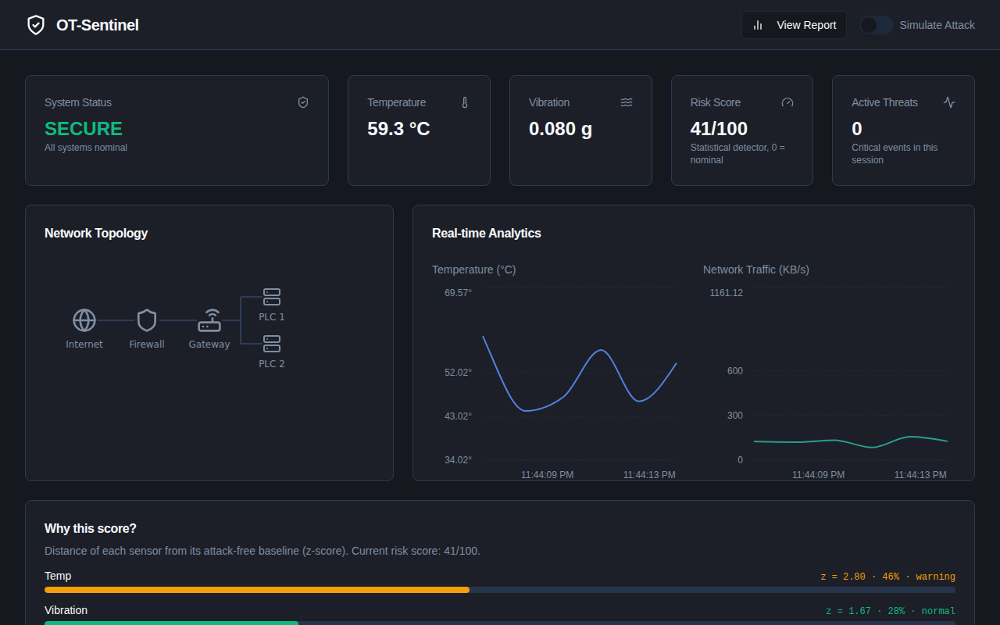
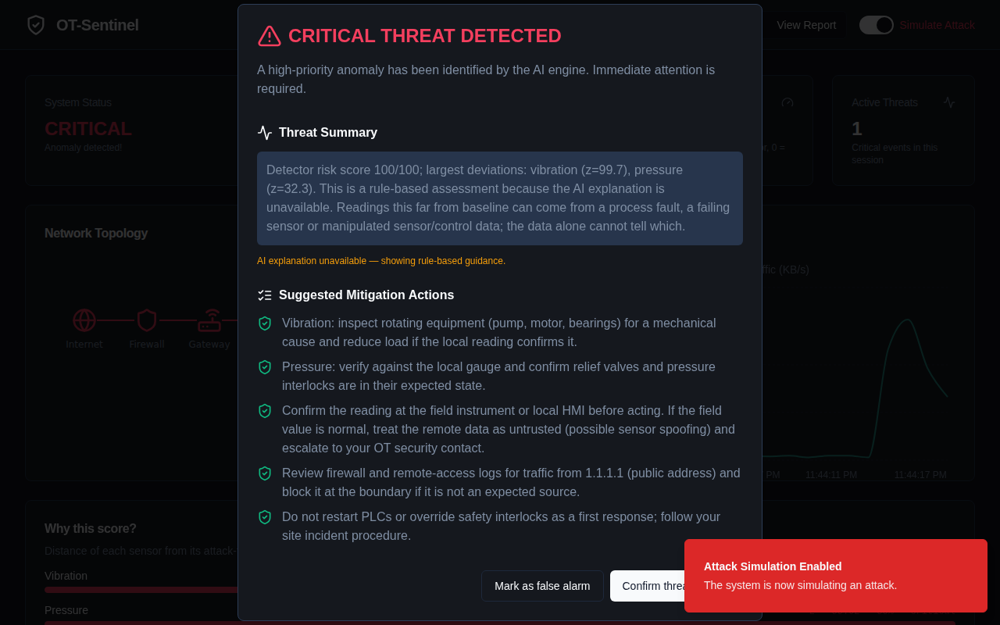
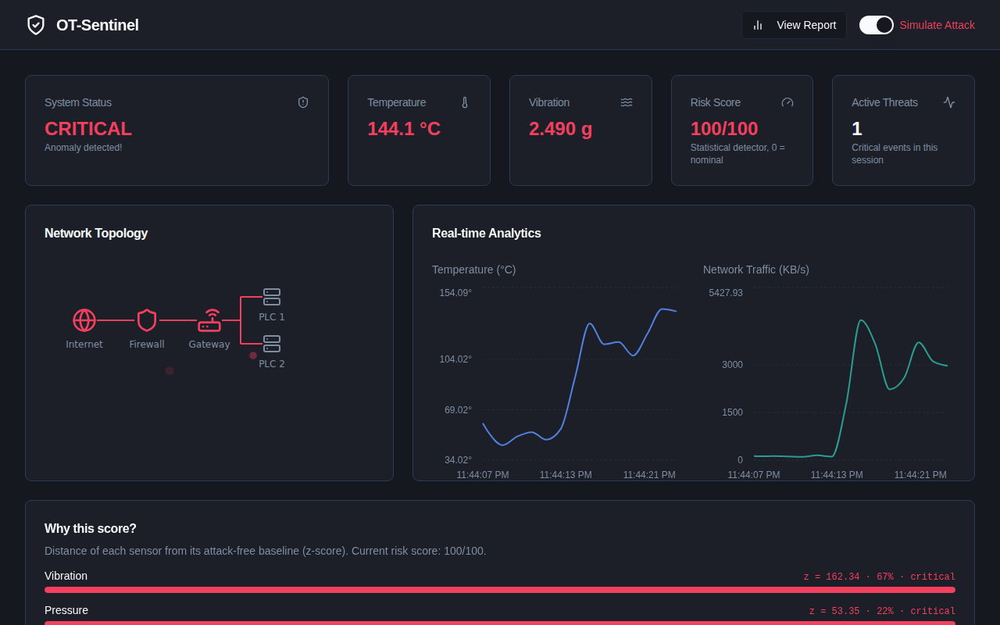

# OT-Sentinel

[](https://github.com/senanurcetin/ot-sentinel/actions/workflows/ci.yml)
[](https://github.com/senanurcetin/ot-sentinel/actions/workflows/e2e-tests.yml)
[](https://github.com/senanurcetin/ot-sentinel/actions/workflows/security-checks.yml)


**An explainable anomaly dashboard for industrial (OT) telemetry.** A statistical detector decides
whether a reading is anomalous and which sensors drive it; an LLM turns that verdict into
operator-friendly triage; a deterministic fallback keeps the guidance useful when the LLM is
unavailable. Telemetry is simulated; the comparison against real attack data is built but
**not yet run** (see [Evaluation](#evaluation)).



Walkthrough video: [`docs/assets/ot-sentinel-demo.webm`](docs/assets/ot-sentinel-demo.webm) (about 35 s: normal operation → simulated attack → alert → forensic report). It was recorded without a Gemini key, so the alert shows the rule-based guidance, not an AI answer. Earlier version of the project: [YouTube walkthrough](https://www.youtube.com/watch?v=KcpTW0QM0FM).

Reviewing this project? Start with the [case study](docs/case-study.md) and the [reviewer summary](docs/hiring-summary.md).

## Status

| Part | State |
|---|---|
| Dashboard, detector, explanation, fallback, operator feedback | working, tested |
| Telemetry | **synthetic** (a `TelemetrySource` interface is the seam for replay / read-only adapters) |
| Real-data evaluation (BATADAL) | pipeline built and tested on synthetic data, **not run** |
| Authentication, persistence, real protocol adapters | not implemented |

Portfolio role: `OT-security case study (evaluation pending a real-data run)`.

## Why this project exists

Plant teams often have monitoring signals but no clear workflow for interpreting an anomaly,
judging severity and recording what was done. OT-Sentinel explores one answer: keep detection simple
and auditable, make the reason for every alert visible, and use an LLM only to explain, never to decide.

## What it does

- Streams (simulated) temperature, pressure, vibration and traffic readings once a second.
- Scores every sample against an attack-free baseline and shows **why**: per-sensor z-score and each sensor's share of the risk score.
- On a CRITICAL sample, opens an alert with a summary and suggested actions. Gemini writes it when available; otherwise a rule-based fallback does, and the dialog says which one you are reading.
- Lets the operator mark each alert as a confirmed threat or a false alarm (`POST /api/feedback`, in-memory demo storage).
- Simulates an attack on demand, and exports a forensic report as CSV (spreadsheet-formula safe).

| Alert with rule-based guidance | Why this score? |
|---|---|
|  |  |

## Architecture

Next.js App Router (React 19, TypeScript), Genkit + Gemini 2.5 Flash, Tailwind + shadcn/ui,
Recharts, zod. Python (`analysis/`) holds the evaluation pipeline and generates the detector's
constants. Diagrams and the alert sequence are in [`docs/architecture.md`](docs/architecture.md).

The detector's parameters live in `src/data/model/scorer-params.json`, generated by
`analysis/export_model.py`; the [model card](MODEL_CARD.md) parameter table is generated from the
same file, and `pytest` fails if either goes stale.

## Evaluation

**Not run yet.** [`analysis/`](analysis/README.md) implements a comparison on the public
[BATADAL](https://www.batadal.net/data.html) water-distribution attack benchmark: a static-limit
rule, this z-score scorer, an Isolation Forest and a supervised reference, all set to the same
false-alarm budget and scored on event-level recall, time-to-detect, false alarms per day and
PR-AUC. It is tested on synthetic data but has never been executed on BATADAL (the authoring
environment could not reach the dataset host), so **this repository publishes no detection metrics**
and makes no claim about how well the detector finds real attacks. A test keeps the documentation
honest: while no results file exists, the docs must say so and must not contain metric values.

## Quick start

```bash
npm install
cp .env.example .env     # optional: add GEMINI_API_KEY; without it the rule-based fallback is used
npm run dev              # http://localhost:9002 , toggle "Simulate Attack"
```

Docker:

```bash
docker build -t ot-sentinel .
docker run --rm -p 9002:9002 -e GEMINI_API_KEY=your-key ot-sentinel
```

## Quality checks

```bash
npm run lint
npm run typecheck        # includes test files
npm run test:coverage    # Jest + coverage thresholds
npm run build
npm run test:e2e         # Playwright; run `npx playwright install chromium` once
cd analysis && pip install -r requirements-dev.txt && ruff check . && pytest
```

CI runs all of the above plus a Docker build, CodeQL, `npm audit`, `pip-audit` and secret scanning.

## Security

Security headers and CSP, per-client rate limits, validated inputs, a model timeout with fallback,
and CSV formula-injection protection. The demo has **no authentication**; do not expose it to an
untrusted network or connect it to a live control system. Scope, residual risks and an ATT&CK for
ICS mapping: [`docs/threat-model.md`](docs/threat-model.md). Report issues via [`SECURITY.md`](SECURITY.md).

## Repository map

| Path | What |
|---|---|
| `src/app/` | pages and API routes (`/api/metrics`, `/api/feedback`) |
| `src/lib/` | scorer, telemetry source, fallback guidance, rate limiter, security headers, CSV export |
| `src/ai/flows/` | Genkit flow behind the alert dialog |
| `src/components/` | dashboard UI |
| `analysis/` | evaluation pipeline, model-constants export, Python tests |
| `tests/e2e/` | Playwright tests |
| `docs/` | [architecture](docs/architecture.md), [threat model](docs/threat-model.md), [case study](docs/case-study.md), [reviewer summary](docs/hiring-summary.md), [archived original spec](docs/archive/blueprint.md) |

## Related work

[Vision2DCS](https://github.com/senanurcetin/Vision2DCS) includes a rule-based "OT Sentinel" audit of
P&ID extractions (ISA-5.1 tag naming, safety-function keywords, loop integrity). It is a different
tool from the telemetry detector in this repository.

## Limitations

Synthetic telemetry; per-sample static baseline (no drift, missing-data or stuck-value detection);
three sensors; in-memory feedback; no authentication. See the [model card](MODEL_CARD.md).

## License

[MIT](LICENSE)
