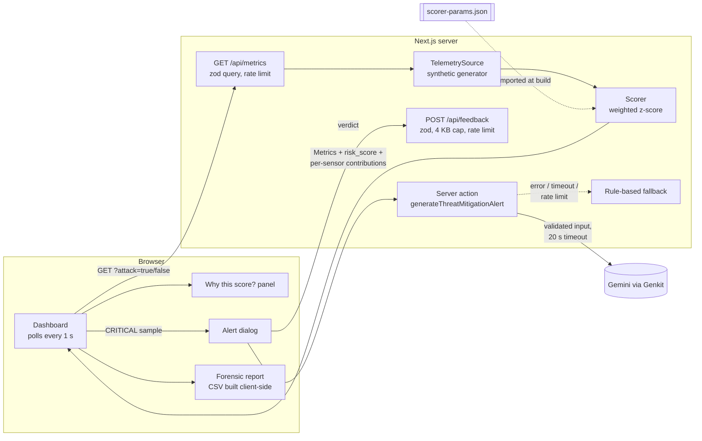
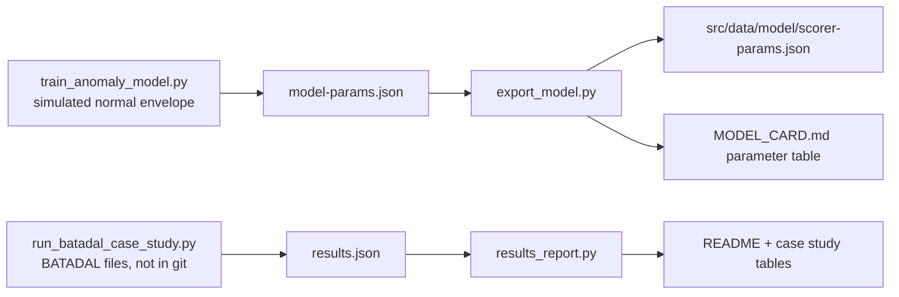

# Architecture

Everything below exists in the code today. Items marked *planned* do not.

## Components



## Offline: how the detector's constants are produced



`export_model.py --check` (run by `pytest`) fails if the artifact or the model card table is stale,
so the TypeScript scorer, the Python side and the documentation cannot drift apart. The BATADAL
evaluation writes `results.json`; `results_report.py` renders every number in the README and the case
study from it (a test fails if a table is stale). Nothing in the running app reads `results.json`.

## What happens when an alert fires

```mermaid
sequenceDiagram
  participant UI as Dashboard
  participant API as /api/metrics
  participant SA as Server action
  participant LLM as Gemini
  UI->>API: GET ?attack=...
  API-->>UI: sample, risk_score = 88, status = CRITICAL
  UI->>SA: threat data (detector verdict + sensor contributions)
  SA->>SA: validate (zod), rate-limit per client
  alt model answers within 20 s
    SA->>LLM: explain this verdict, do not re-decide it
    LLM-->>SA: summary + actions
    SA-->>UI: source = ai
  else error, timeout or rate limit
    SA-->>UI: rule-based guidance, source = fallback
  end
  UI->>UI: show dialog; operator picks "false alarm" or "confirm"
  UI->>API: POST /api/feedback (verdict + risk score + driving sensor)
  API->>API: SQLite if FEEDBACK_DB_PATH is set, else memory
```

## Design decisions

- **The detector decides, the LLM explains.** The model is told the verdict is final, and the UI
  labels fallback guidance so a missing key never looks like an AI answer.
- **One source for constants.** Scorer parameters are generated, not typed twice.
- **Narrow telemetry boundary.** `TelemetrySource` is the only thing the route knows about; replay
  and read-only protocol adapters are *planned* and must stay read-only
  ([threat model](threat-model.md#telemetry-adapter-boundary)).
- **Small, bounded state.** Operator verdicts go to SQLite through Node's built-in `node:sqlite` when
  `FEEDBACK_DB_PATH` is set (the Docker image sets it), otherwise to a capped in-memory buffer. Both are capped
  because the demo has no authentication ([`src/lib/feedback-store.ts`](../src/lib/feedback-store.ts)).

See also: [threat model](threat-model.md) · [model card](../MODEL_CARD.md) ·
[analysis pipeline](../analysis/README.md) · [original spec (archived)](archive/blueprint.md)
